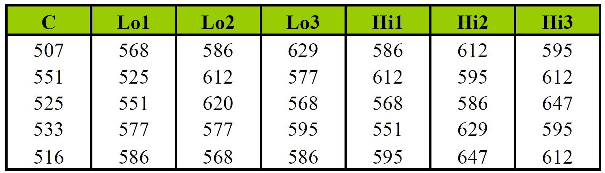
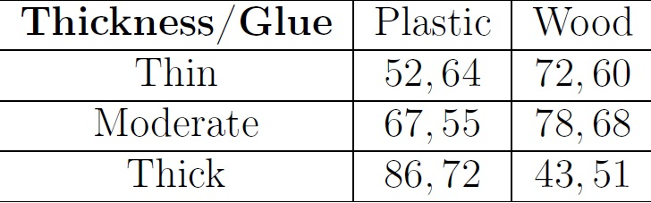

<!--- Below are global settings for knitr. You can override any of them by adding the changes to individual chunks --->

```{r global_options, include = FALSE}
knitr::opts_chunk$set(error = TRUE,        # Keep compiling upon error
                      collapse = TRUE,     # collapse by default
                      echo = TRUE,         # echo code by default
                      comment = "#>",    # change comment character
                      fig.width = 9,     # set figure width
                      out.width = "100%", # set width of displayed images
                      warning = TRUE,      # show R warnings
                      message = FALSE)     # show R messages
```

<!--- Solution Region --->
<style>
#solution {
  background-color: #8FBC8F;
  border-style: solid;
  border-color: blue;
  margin-left: 5px;
  margin-bottom: 15px;
  padding: 5px;
}
</style>

*******************************************

# Problem 1 (MLR)

So-called "Funds of Hedge Funds" (FoHF), i.e. portfolios of hedge funds, have different investment strategies with specific returns and risk properties. When such a product is evaluated it is important for the investor to choose the investment style that fits his needs.

One approach to assess the investment strategy of a FoHF as an outsider is to perform a style analysis based on the returns. Using a regression model (also called multi-factor model in the financial industry) one aims to explain the returns of the FoHF with the returns of the so-called subindices of hedge funds (Long Short Equity, Fixed Income Arbitrage, Global Macro, etc.). The estimated parameters are indications for the chosen investment strategy. Note that not all investment strategies are present due to the construction of FoHFs. 

The file `FoHF.rda` contains the monthly returns of one FoHF and the hedge fund subindices of EDHEC from January 1997 until December 2004. The meaning of the individual predictors is as follows:

+ `RV` Relative value
+ `CA` Convertible Arbitrage
+ `FIA` Fixed Income Arbitrage
+ `EMN` Equity Market Neutral
+ `ED` Event Driven Multistrategy
+ `DS` Distressed Securities
+ `MA` Merger Arbitrage
+ `LSE` Long Short Equity
+ `GM` Global Macro
+ `EM` Emerging Markets
+ `CTA` CTA / Managed Futures
+ `SS` Short Selling

(a) Fit a model containing all predictors. Look at the output of summary. What conclusion can you draw with respect to the investment strategy of this FoHF when you consider the estimated coefficients, the p-values, the global F-test and the multiple R-squared?

(b) [1] Check whether this model is valid or whether any assumptions are violated. [2] Also test whether there are problems with respect to multicollinearity and [3] whether all predictors have been entered into the model in the correct form.

(c) If you have solved the previous subproblem correctly, you will have found some issues. Formulate a strategy how those can be fixed in order to obtain a valid and interpretable result.

(d) Perform variable selection using the BIC criterion.

# Problem 2 (MLR \& CV)

The file `CustomerWinBack.rda` provides a dataframe called `cwb`. It contains information about how long could a company hold costumers that cancelled the contract at some point in the past and re-opened their contracts afterwards. There are 295 observations of the following variables:

+ `duration` target variable, duration of the customer relationship in days
+ `offer` value of the present offered at re-acquisition
+ `lapse` time until the customer could be re-acquired
+ `price` offered price change in comparison to the first contract
+ `gender` gender. 0 $=$ female and 1 $=$ male
+ `age` age of the customer

The goal is to find a good model for the `duration` of the new customer relationship. Since we are primarily interested in an accurate prediction, we use cross validation to evaluate the predictive performance.

(a) Change the variable `gender` to a factor variable and re-label its levels using "Female" and "Male".

(b) Make a scatter plot matrix of this data. Comment on any necessary patterns, variable transformations that are needed.

(c) Fit the following models:

+ `fit1` OLS with all variables.

+ `fit2` Model chosen by using the BIC criterion.

(d) Use a 5-fold cross validation to compare the predictive performance of the two models. Repeat your CV for 100 times, then make a side-by-side boxplot of the `delta[1]` values. Generally, which model has stronger prediction ability?

# Problem 3 (Onw-way ANOVA)

The objective of the following crop management experiment is to test the effect of applied copper sulfate on grape yield by three methods: A single application for the season (1), two applications over the course of the season (2), and three applications over the course of the season (3). For each one of these application strategies, the total amount of copper sulfate was applied at two rates (Hi and Lo). A control (C) receiving no copper sulfate was also included, resulting in a total of 7 treatments (C, Lo1-3, Hi1-3) which were randomly assigned to 35 rows of vines in the an experimental vineyard. The yield data (in pounds) is presented below:



## 3.1 What is the response variable? and the experimental unit?

## 3.2 Visualize the data.

## 3.3 Present a table of orthogonal coefficients to answer the following questions:

a. Is there a significant yield response to copper sulfate?
b. Is the average yield response different at the two rates (Hi and Lo)?
c. Are split applications superior to a single application?
d. Considering the split applications only, is there a difference between double and triple applications?
e. Does the application method, single or split, influence the effects of the different copper sulfate rates (Hi and Lo)?
f. Does the number of split applications influence the effects of the different copper sulfate rates (Hi and Lo)?

## 3.4 Use R to solve the contrasts you formulated. 

## 3.5 Interpret all your output and write your conclusions to the six questions above based on the results.

# Problem 4 (Two-way ANOVA)

Consider the following small dataset, recording response variable as the amount of **force** in Newtons that it takes to separate two pieces of plastic that have been glued together, with two factors: **thickness** of the material (thin, moderate, thick), and the **type** of glue used (wood vs. plastic). There are two cases at each combination of factors. 



## 4.1 Visualize the data with **one** suitable plot. (Note: I want your plot to show both the distribution and interaction!)

## 4.2 Write down the interaction model to fit this data.

## 4.3 Fit your model. Is the interaction effect significant at 5% significance level?

## 4.4 Make a line plot of the `Glue` effects across the levels of `Thickness`.

## 4.5 Make a line plot of the pairwise comparison of `Glue` effects across the levels of `Thickness`.


